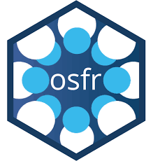

# A little about the lab..

The Virginia Philosophy Reality Lab is an interdisciplinary coalition of educators and researchers at [Old Dominion University](https://www.odu.edu/) in Norfolk, Virginia, that explores philosophical issues through extended reality (XR) technologies. We are currently developing virtual reality modules on the basis of philosophical thought experiments to be used as educational tools in the classroom and research tools for experimental studies.

The Virginia Philosophy Reality Lab is a partnership between the ODU [Department of Philosophy and Religious Studies](https://www.odu.edu/philosophy) and the [Virginia Modelling, Analysis, and Simulation Center](https://www.odu.edu/vmasc). It also works with students and faculty in the ODU [Game Studies & Design Program](https://www.odu.edu/academics/programs/undergraduate/game-studies-design) to create compelling XR experiences that explore philosophical ideas, such as the ethics of life and death decisions in real and virtual contexts.

# Some quick things to get you started...

<!-- Do not delete -->

<div class="flex-brandon">

```
<!-- Link to website goes here -->
<a href="">
  <div class="card card--clickable">
    <div class="card__image">
      
    </div>
    <div class="card__content">
      <div class="card__header">
        <!-- Name of resource goes inside the <h4> tags-->
        <h4>Photograph</h4>
      </div>
      <!-- Description goes inside the <p> tags -->
      <p>...</p>
    </div>
  </div>
</a>

<!-- https://github.com/VPRL/Virginia-Philosophy-Reality-Lab -->
<a href="">
  <div class="card card--clickable">
    <div class="card__image">
      
    </div>
    <div class="card__content">
      <div class="card__header">
        <!-- Name of resource goes inside the <h4> tags-->
          <h4>Our Github</h4>
        </div>
        <!-- Description goes inside the <p> tags -->
        <p>Click here to go to the Github repo of Open Source VR philosophy projects</p>
    </div>
  </div>
</a>

<!-- Link to website goes here -->
<a href="">
  <div class="card card--clickable">
    <div class="card__image">
      
    </div>
    <div class="card__content">
      <div class="card__header">
        <!-- Name of resource goes inside the <h4> tags-->
          <h4>Photograph</h4>
        </div>
        <!-- Description goes inside the <p> tags -->
        <p>...</p>
    </div>
  </div>
</a>
```

</div>